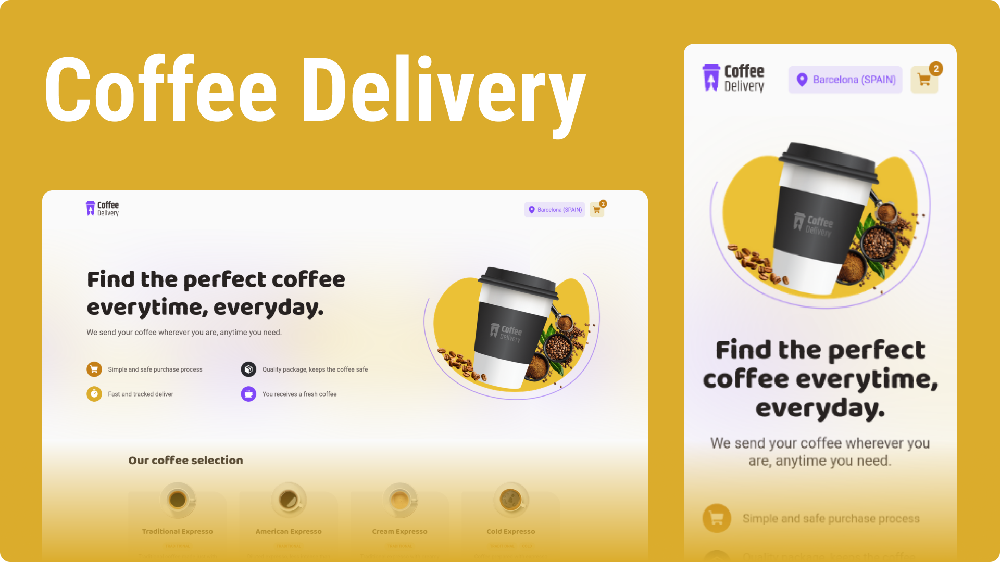

<p align="center">
  
    
</p>
<h1 align="center">
  Coffee Delivery
</h1>
<h5 align="center">
   A simple Coffee Delivery App with Redux Toolkit to manage states
</h5>


## 💻 About Project

This project is an application to manage a shopping cart from a fictitious coffee shop, which contains the following features:

- List of products (coffees) available for purchase
- Add a specific amount of items in the cart
- Increase or remove the number of items in the cart
- Form to fill their address
- Display the total items in the cart in header
- Display the total value of the sum of items in the cart multiplied by the value of each


## 🔧 Technologies used

- [Vite](https://vitejs.dev/)
- [TypeScript](https://www.typescriptlang.org/)
- [React Router Dom](https://reactrouter.com/en/v6.3.0)
- [Styled Components](https://styled-components.com/)
- [React Redux](https://react-redux.js.org/)
- [React Hook Form](https://react-hook-form.com/)


You can see it **live** --> [LIVE PAGE](https://coffee-delivery-andradept.vercel.app/).

---

## :octocat: How to test and install

Clone this repository:

```sh
git clone https://github.com/edu2andrade/coffee-delivery.git
```

Install dependencies:

```sh
yarn
```

Start development environment:

```sh
yarn dev
```


## 📝 License

This project is under [MIT License](./LICENSE).


## 👽 Author

Made with 🤘 by [Eduardo Andrade](https://andradept.com/)
